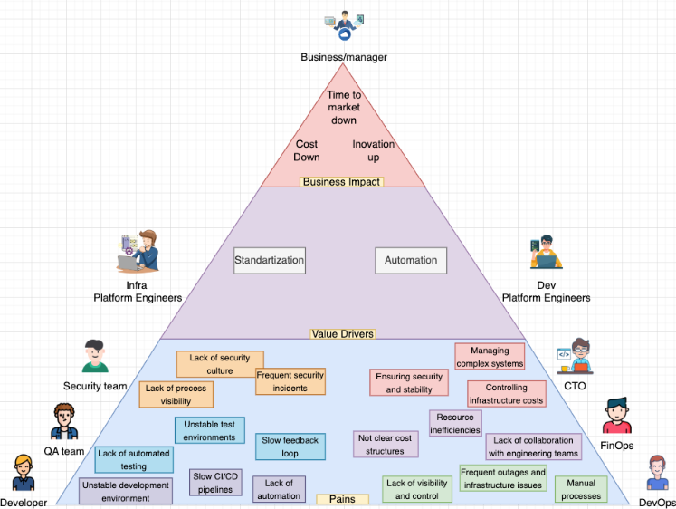
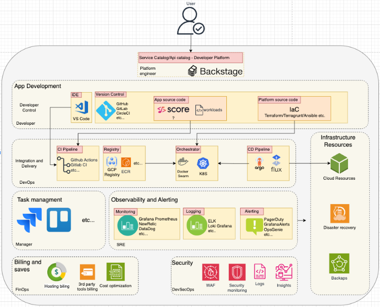

# Home Page

### Platform Definition  
A platform is a comprehensive system that provides the foundation or environment for the development, deployment, execution, and management of applications, services, and processes. It combines a set of tools, services, APIs, and infrastructure components necessary for launching other applications or systems. The platform acts as a bridge, simplifying interactions between various roles in a project, automating and standardizing processes, and creating a unified environment for development and operation.

### Our Understanding of the Platform at ITSyndicate  
At ITSyndicate, we view each project as a distinct platform, specifically tailored to the needs of a particular company. Project = Platform. Our specialists work to implement the best practices of DevOps, GitOps, DevSecOps, SRE, and FinOps. We’ve been doing this for the entire duration of the company’s existence, and the next step in our development is to integrate all these practices into a unified platform and visualize them.  
Together, we create a platform that:  
- Enables developers to work efficiently.  
- Improves the security of infrastructure and applications.  
- Adds resilience, ensuring stability and reliability.  
- Helps quickly respond to issues and prevent them through monitoring and alerting.  
- Helps businesses save and increase capital.  
- Gives managers the ability to oversee and control processes.  
- Provides a global view of the entire project.  

The platform also serves as a kind of checklist, which allows us to clearly define the direction of project development. The goal is to provide a unique and flexible solution for each client while maintaining unified standards and approaches in automation, standardization, and management.

### Problems Solved by the Platform  
The platform and the project as a whole are built for users. The application is developed for end users—the clients of our clients. Our platform, in turn, is created for our clients, as they are the ones who develop on it. Therefore, we must develop the platform with care for our users, solving the tasks and needs of developers, testers, CEOs, CTOs, managers, and other roles involved in the project.

The key problems the platform solves include:  
- **Speeding time-to-market**: By automating processes, the platform accelerates the release of new features.  
- **Reducing costs**: Through standardization and resource optimization.  
- **Increasing innovation**: The platform allows engineers to focus on development and implementation of new solutions, without being distracted by routine tasks.  

### Core Principles and Purpose of the Platform  
The core principles of the ITSyndicate platform are:  
- **Automation**: Minimizing manual operations, from CI/CD to monitoring and infrastructure management.  
- **Standardization**: A unified approach to infrastructure-as-code (IaC), CI/CD, application development, etc.  
- **Modularity**: The ability to integrate additional components and tools depending on the client's needs.  
- **Security**: Ensuring all aspects of DevSecOps for data and infrastructure protection.  
- **Visualization**: Providing a visual representation of project processes and settings, making it easier for users to control and manage the system.  

These principles form the foundation of our platform and are aimed at creating a convenient, flexible, and reliable solution for each client. The tools to implement these principles may vary depending on the project and its needs, but the direction remains consistent.

### Why Are We Building a Platform?  
Our platform is being developed to consolidate all key processes and tools in one place, making them understandable and accessible. This simplifies the team’s work, allows for faster problem-solving, and enables scalability of solutions. Ultimately, the platform helps our clients achieve their goals faster, reduce costs, and increase business efficiency.

### How Do We Start?  
The first thing we do is plan, and only then do we implement our practices and approaches. Only after implementing something like monitoring can we say it’s done and ready to integrate this part of the project into Backstage. We do not build Backstage purely for visualization! Visualization is only 10% of the entire platform. Regardless of whether we use Backstage or work without it, we are building the platform.

### Platform Components  
The platform consists of several key components, each playing a role in supporting the team’s work and fulfilling project requirements:  
1. **Home Page**: A starting page for quick navigation.  
2. **App Development**: Includes CI/CD and documentation for processes.  
3. **Task Management**: Integration with the client's ticketing system.  
4. **Billing**: Analysis and display of project expenses—not only hosting but also all tools and additional parts of the project.  
5. **Security**: Security monitoring.  
6. **Monitoring, Logging, Alerting**: Application and infrastructure monitoring, logging, and alerting.  
7. **Hosting**: Integration with the client's cloud or hosting solutions.  
8. **Admin Page**: Platform and role management settings.  
9. **User Page**: User’s personal page.  
10. **Catalog**: A catalog of available plugins for the platform.  

These components form the backbone of the platform, providing ease of use, integration of necessary tools, and visualization of key metrics.

### Table of Contents  
A guide for each part of the platform and the principles engineers should follow when building it:  
- **App Development**: DevOps/GitOps approaches, modular development.  
- **Billing**: FinOps approaches for effective cost management.  
- **Security**: DevSecOps approaches for ensuring security.  
- **Monitoring**: SRE approaches for reliable monitoring.  
- **Hosting**: Cloud Engineering and Solution Architecture approaches for scalable solutions.  
- **Backstage Platform**: Approaches and documentation for Backstage setup.  

Each section of the documentation will include:  
- A description of tasks and the component’s purpose.  
- Core principles and approaches.  
- Setup and integration instructions.  
- Recommendations and best practices.  

This structure will give your engineers a clear understanding of the platform’s goals and functions, as well as the approaches they should apply in their work.