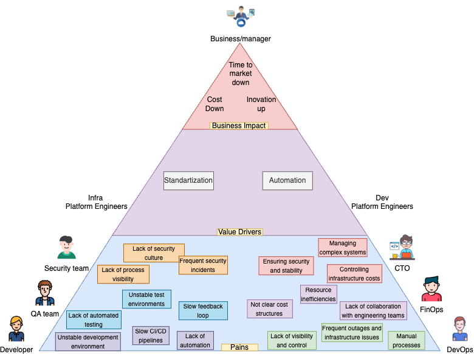
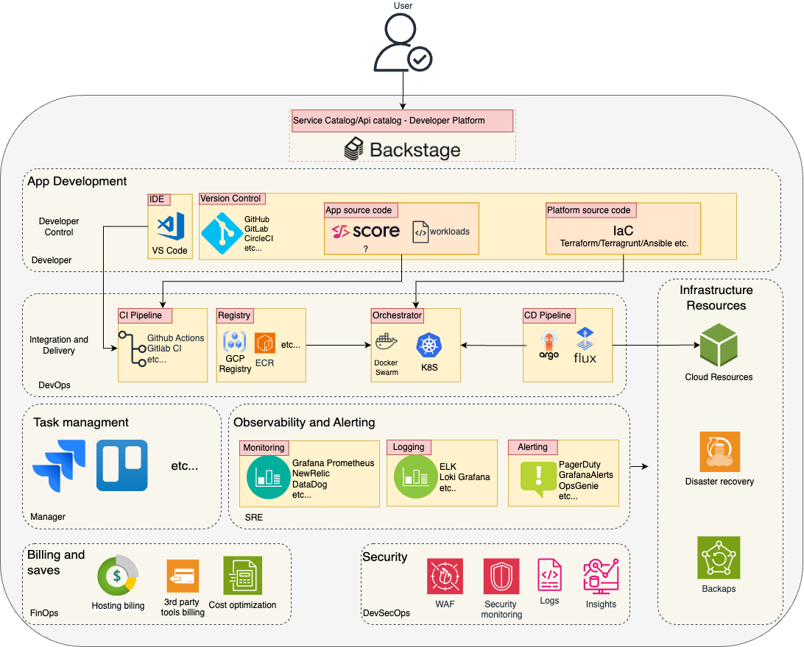

# ITSyndicate Development Platform

## Home Page

### Definition of the Platform

A platform is a comprehensive system that provides a foundation or environment for developing, deploying, executing, and managing applications, services, and processes. It brings together a set of tools, services, APIs, and infrastructure components necessary for running other applications or systems. The platform acts as a bridge, simplifying interactions between various project roles, automating and standardizing processes, and creating a unified environment for development and operations.

### Our Understanding of the Platform at ITSyndicate

At ITSyndicate, we view each project as a separate platform, specifically tailored to the needs of a particular company. Project = Platform. All our specialists work towards implementing best practices in DevOps, GitOps, DevSecOps, SRE, and FinOps. We have been doing this throughout the company’s existence, and the next stage of our development involves unifying all these practices into a single platform and visualizing them.

Together, we are crafting a platform that:  
•	Allows developers to work efficiently.   
•	Enhances the security of infrastructure and applications.   
•	Adds fault tolerance, ensuring stability and reliability.     
•	Helps quickly respond to and prevent issues through monitoring and alerting.  
•	Assists the business in saving and increasing capital.  
•	Gives managers the ability to oversee and control processes.  
•	Enables visibility into the global picture of the entire project.  

The platform also serves as a kind of checklist that clearly defines the project’s development vector. The goal is to provide a unique and flexible solution for each client while maintaining unified standards and approaches in automation, standardization, and management.

### Problems Solved by the Platform

The platform and the project itself are built for users. The application is developed for end-users—the clients of our clients. Our platform, in turn, is created for our clients since they develop on it. Therefore, we must design the platform with care for our users, addressing the tasks and needs of developers, testers, CEOs, CTOs, managers, and other roles involved in the project. We must create a golden path for each team and allow them to develop the product through our platform. 

#### The main problems the platform solves include:  
•	Accelerating Time-to-Market: Automation speeds up the release of new features.  
•	Reducing Costs: Through standardization and resource optimization.  
•	Increasing Innovation: The platform allows engineers to focus on developing and implementing new solutions without being distracted by routine tasks.  

### General Principles of the Platform and Its Purpose

Core Principles of the ITSyndicate Platform:
•	Automation: Minimizing manual operations, from CI/CD to monitoring and infrastructure management.  
•	Standardization: A unified approach to Infrastructure as Code (IaC), CI/CD, application development, etc.  
•	Modularity: The ability to integrate additional components and tools based on client needs.  
•	Security: Ensuring all aspects of DevSecOps to protect data and infrastructure.  
•	Visualization: Providing a visual representation of processes and project settings, making it easier for users to control and manage the system.  

These principles form our platform's foundation and aim to create a convenient, flexible, and reliable solution for each client. The tools to implement these principles may vary depending on the project and its needs, but the direction remains unchanged.

**Why Are We Building the Platform?**

Our platform is being created to unify all key processes and tools in one place, making them understandable and accessible. This simplifies the team’s work, allows for faster problem-solving, and scales solutions. Ultimately, the platform helps our clients achieve their goals faster, reducing costs and increasing business efficiency.

**Where Do We Start?**

The first thing we do is plan, and only then we implement our practices and approaches. Only after we have implemented, for example, monitoring, can we say that this aspect is covered in the project, and we are ready to integrate this part into the Backstage platform. **We don't use Backstage purely for visualization!** Visualization is only 10% of the entire platform. Regardless of whether we use Backstage or work without it, we are building a platform. 

### Components of the Backstage Platform

The platform consists of several key components, each playing a role in supporting the team’s work and meeting project requirements:
1.	Home Page — The starting page for quick navigation.  
2.	App Development — Includes CI/CD, k8s, and process documentation.  
3.	Task Management — Integration with the client’s ticketing system.  
4.	Billing — Analysis and display of project expenses, including hosting and all tools and additional project parts.  
5.	Security — Security monitoring.  
6.	Monitoring, Logging, Alerting — Monitoring of applications and infrastructure, as well as logging and alerts.  
7.	Hosting — Integration with the client’s cloud or hosting solutions.  
8.	Admin Page — Platform and role settings and management.  
9.	User Page — User’s personal page.  
10.	Catalog — Catalog of available plugins for the platform.  

These components form the basis of the platform, ensuring ease of use, integration of all necessary tools, and visualization of key metrics.

## Table of Contents

A guide to each part of the platform and the principles engineers should adhere to when building it:  
•	[App Development](https://gitlab.itsyndicate.org/backstage/platform/-/wikis/home/App-Development) — DevOps/GitOps approaches, modular development.  
•	[Billing](https://gitlab.itsyndicate.org/backstage/platform/-/wikis/home/Billing) — FinOps approaches for effective cost management.  
•	[Security](https://gitlab.itsyndicate.org/backstage/platform/-/wikis/home/security) — DevSecOps approaches to ensure security.  
•	[Monitoring](https://gitlab.itsyndicate.org/backstage/platform/-/wikis/home/monitoring) — SRE approaches for reliable monitoring.  
•	[Hosting](https://gitlab.itsyndicate.org/backstage/platform/-/wikis/home/hosting) — Cloud Engineering and Solution Architecture approaches for scalable solutions.  
•	[Backstage Platform](https://gitlab.itsyndicate.org/backstage/platform/-/wikis/home/backstage) — Approaches and documentation for setting up Backstage.  

